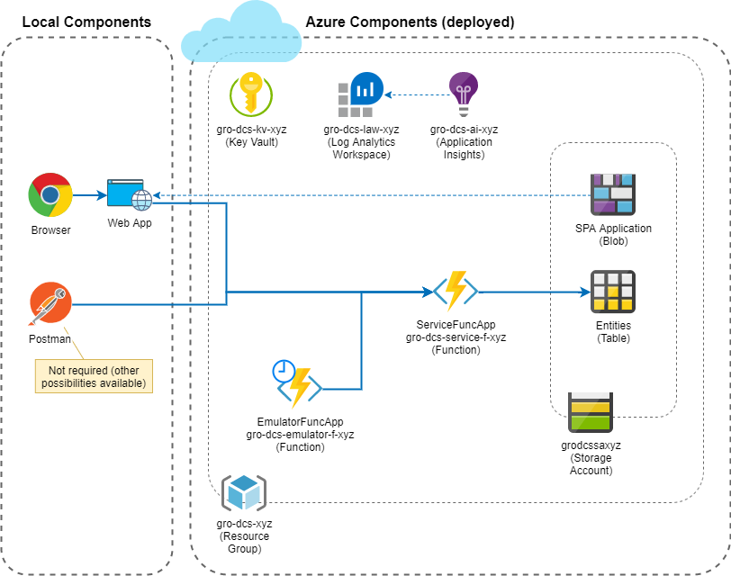

# Architecture
## Application Components (Azure Services)

## Data Model

# Deployment
Make sure [Azure PowerShell](https://github.com/Azure/azure-powershell#installation) is installed on your device and run script `Garaio.DevCampServerless.Deployment\Deploy-AzureResourceGroup.ps1`.