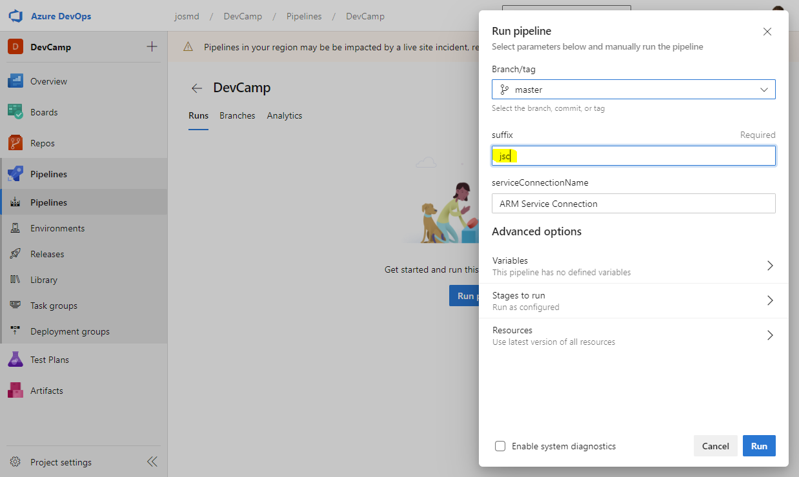

# Setup Manual
This process should work with any device. You just need an Internet Browser and connectivity (there is no need to install any particular tools).

## Init Azure DevOps project and link with Azure Subscription
1. 
1. 
1. 
1. 
1. 
Service connection name: **ARM Service Connection** (_basically it could be any value - but the prepared pipeline references this particular name_)

## Import / fork the Repository
1. 
Clone URL: **https://github.com/garaio/DevCamp-AzureServerless**

## Create CI/CD Pipeline
1. 
1. 
1. 
1. 
Path: **Foundation/Garaio.DevCampServerless.Deployment/azure-pipeline.yml**
1. 
1. 
1. 
Suffix: **Specify any value which uniquely identifies the environment (e.g. your name abbreviation)**