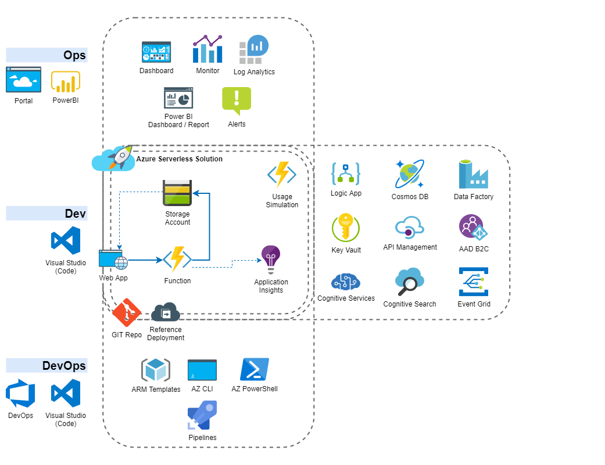

# Overview
This repository contains a basic "Azure Serverless Application" as a basis for the implementation of additional functionality. The purpose of this is education.

> For documentation of Azure services, architecture patterns and other theory material consider Microsoft sites. A recommandation: [Serverless apps: Architecture, patterns, and Azure implementation](https://docs.microsoft.com/de-de/dotnet/architecture/serverless).
> [Microsoft Learn](https://docs.microsoft.com/en-us/learn/azure/) platform contains plenty of high-quality tutorials which are very much recommended. Specifically there is a Learning Path ["Create serverless applications"](https://docs.microsoft.com/de-de/learn/paths/create-serverless-applications/).

Providing customers with a solution based on Azure Services at a professional level, requires competencies of: Development, provisioning and operational management. These 3 pillars are equally important and relevant in all phases of an implementation project. This lab contains challenges for those pillars which are inspired by real world situations and requirements of GARAIO AG projects.

# General Preparations
You need to have your own Azure subscription to work with this lab. As a GARAIO employee you have these two possibilities for a subscription with sufficient budget:
- MSDN Subscription: Go to http://my.visualstudio.com/benefits
- Microsoft Azure Pass (ask DevCamp organisator for a Promo Code): Go to https://www.microsoftazurepass.com/

By default, the MSDN-based subscription is tied to the organisation tenant. You can transfer it to a private directory to not pollute the organisations AD with e.g. App Registrations: [Manual](./Resources/Preparation_MSDN-Subscription.md).

# Demo Application
Coming soon.

# Tracks
## Dev
Extend the basic application with additional functionality.

* [Preparation](./Track-Dev/Preparation.md)
* [Challenges](./Track-Dev/Challenges.md)

## DevOps
Implement an "Infrastructure as Code" solution which enables the deployment to new or existing environments. Additionally you may implement a CI/CD strategy with Azure Pipelines.

* [Preparation](./Track-DevOps/Preparation.md)
* [Challenges](./Track-DevOps/Challenges.md)

## Ops
Provide possibilities to visualize operational key aspects of the application. Enable business insights as well as the detection and notification of technical problems and possible optimizations.

* [Preparation](./Track-Ops/Preparation.md)
* [Challenges](./Track-Ops/Challenges.md)

# Solutions
Feel free to share your work. Please follow these [guidelines](./Solutions/Guidelines.md).
