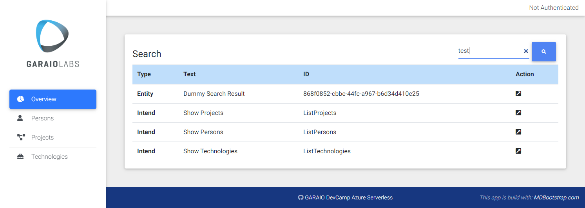
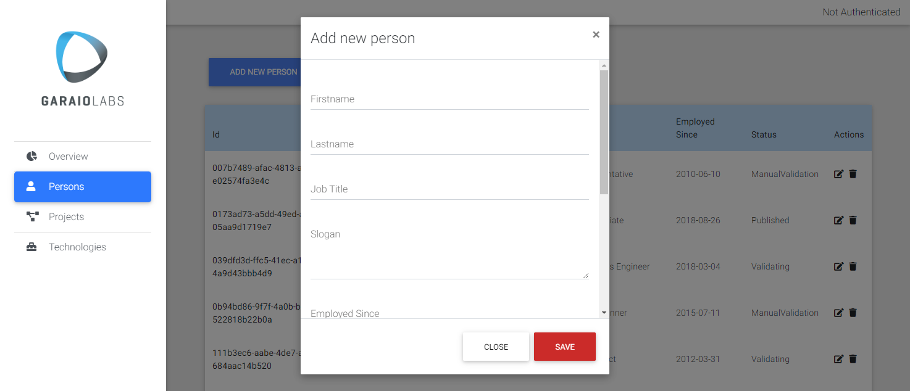
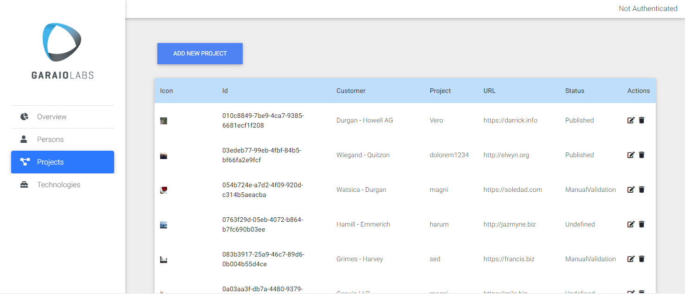
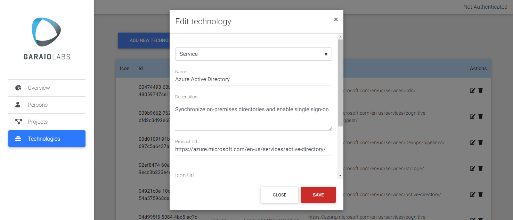

# Overview
This repository contains a basic "Azure Serverless Application" as a basis for the implementation of additional functionality. The purpose of this is education.

> For documentation of Azure services, architecture patterns and other theory material consider Microsoft sites. A recommandation: [Serverless apps: Architecture, patterns, and Azure implementation](https://docs.microsoft.com/de-de/dotnet/architecture/serverless).
> [Microsoft Learn](https://docs.microsoft.com/en-us/learn/azure/) platform contains plenty of high-quality tutorials which are very much recommended. Specifically there is a Learning Path ["Create serverless applications"](https://docs.microsoft.com/de-de/learn/paths/create-serverless-applications/).

Providing customers with a solution based on Azure Services at a professional level, requires competencies of: Development, provisioning and operational management. These 3 pillars are equally important and relevant in all phases of an implementation project. This lab contains challenges for those pillars which are inspired by real world situations and requirements of GARAIO AG projects.

# General Preparations
## Azure Subscription
You need to have your own Azure subscription to work with this lab. As a GARAIO employee you have these two possibilities for a subscription with sufficient budget:
- MSDN Subscription: Go to http://my.visualstudio.com/benefits
- Microsoft Azure Pass (ask DevCamp organisator for a Promo Code): Go to https://www.microsoftazurepass.com/

By default, the MSDN-based subscription is tied to the organisation tenant. You can transfer it to a private directory to not pollute the organisations AD with e.g. App Registrations: [Manual](./Resources/Preparation_MSDN-Subscription.md).

## Azure DevOps
To setup the prepared application you need an Azure DevOps account/organisation with the same user account that you use for the Azure Portal with your Subscription.

You can easily create a new account or add a private organisation if you use your work account. Start here: https://azure.microsoft.com/en-us/services/devops/
* `Sign in to Azure DevOps` with your company account (or if you already have an account)
* `Start free` if you don't yet have a login

# Demo Application
All code artefacts regarding the basic "Azure Serverless Application" you find in the folder `Foundation`. You can (but don't have to) build your realisations of the challenges based on this. It includes a completely automated deployment of all Azure resources (as explained in the "Preparation" document of each track).

# Tracks
## Dev
Extend the basic application with additional functionality. Also includes challenges for the frontend application (JavaScript based).

* [Preparation](./Track-Dev/Preparation.md)
* [Challenges](./Track-Dev/Challenges.md)

## DevOps
Extend the existing "Infrastructure as Code" artefactes and implement a CI/CD strategy.

* [Preparation](./Track-DevOps/Preparation.md)
* [Challenges](./Track-DevOps/Challenges.md)

## Ops
Provide possibilities to visualize operational key aspects of the application. Enable business insights as well as the detection and notification of technical problems and possible optimizations.

* [Preparation](./Track-Ops/Preparation.md)
* [Challenges](./Track-Ops/Challenges.md)

# Learning Pathes
To simplify the selection of challenges depending on your interests here some recommendations:

## No-Code or Application Complexity
* DevOps: [DO03 - Measure Performance](https://github.com/garaio/DevCamp-AzureServerless/blob/master/Track-DevOps/Challenges.md#do03-measure-performance)
* Ops: [O03 - Business Intelligence](https://github.com/garaio/DevCamp-AzureServerless/blob/master/Track-Ops/Challenges.md)

## Client-side Development (JavaScript)
* Mixed with work on Azure services/infrastructure:
  * Dev: [D10 - Client Notifications](https://github.com/garaio/DevCamp-AzureServerless/blob/master/Track-Dev/Challenges.md#d10-client-notifications)
  * Dev: [D22 - Microsoft Teams Integration](https://github.com/garaio/DevCamp-AzureServerless/blob/master/Track-Dev/Challenges.md#d22-microsoft-teams-integration)
  * Dev: [D30 - Simplified Frontend Apps](https://github.com/garaio/DevCamp-AzureServerless/blob/master/Track-Dev/Challenges.md#d30-simplified-frontend-apps)
  * Dev: [D34 - Consolidated Logging](https://github.com/garaio/DevCamp-AzureServerless/blob/master/Track-Dev/Challenges.md#d34-consolidated-logging)
  * DevOps: [DO10 - Vulnerability & License Scanning](https://github.com/garaio/DevCamp-AzureServerless/blob/master/Track-DevOps/Challenges.md#do10-vulnerability-&-license-scanning)
* Pure JavaScript implementations (local)
  * Dev: [D31 - Static Landing Page](https://github.com/garaio/DevCamp-AzureServerless/blob/master/Track-Dev/Challenges.md#d31-static-landing-page)
  * Dev: [D32 - Frontend Component Packaging](https://github.com/garaio/DevCamp-AzureServerless/blob/master/Track-Dev/Challenges.md#d32-frontend-component-packaging)
  * Dev: [D33 - Corporate Design System](https://github.com/garaio/DevCamp-AzureServerless/blob/master/Track-Dev/Challenges.md#d33-corporate-design-system)
  * DevOps: [DO11 - Quality Testing](https://github.com/garaio/DevCamp-AzureServerless/blob/master/Track-DevOps/Challenges.md#do11-quality-testing)
  * DevOps: [DO12 - E2E Testing](https://github.com/garaio/DevCamp-AzureServerless/blob/master/Track-DevOps/Challenges.md#do12-e2e-testing)

# Solutions
Feel free to share your work. Please follow these [guidelines](./Solutions/Guidelines.md).
