# How to link MSDN Azure Subscription with private Tenant
Without this, the subscription is tied to the organisation's tenant (Active Directory) which may reduce flexibility (well, its more a matter of comfort) to work with resources of own (private) organisation. The more it may pollute the organisations directory with accounts and app registrations used for created components and service connections.

You may follow these steps to register your free Azure subscription based on the MSDN subscription assigned to your account and then change the parent directory to your own directory.

1. 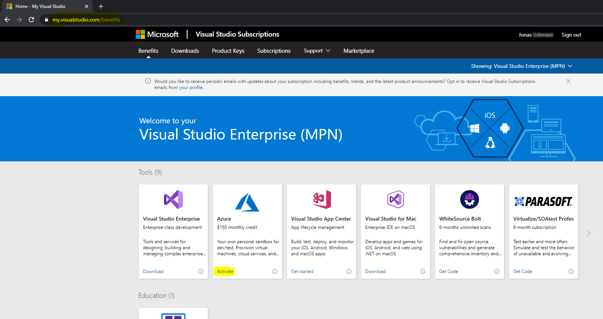
1. 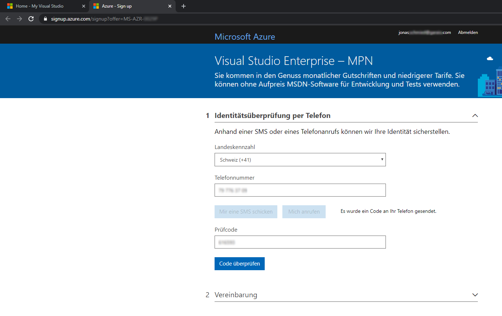
1. 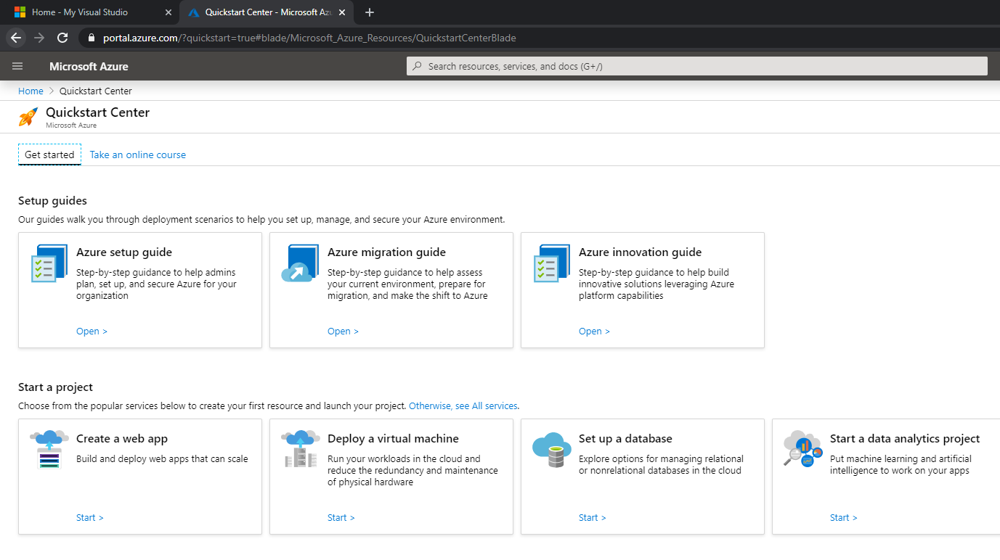
1. 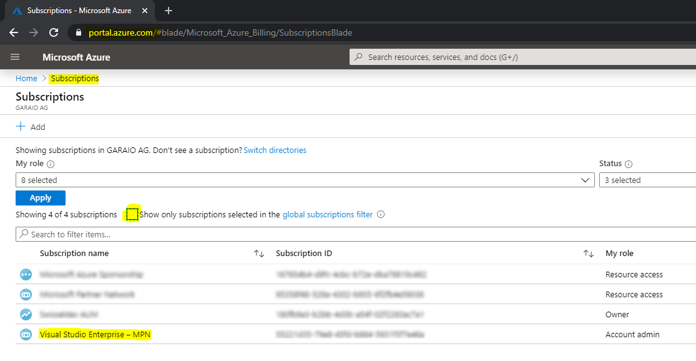
1. 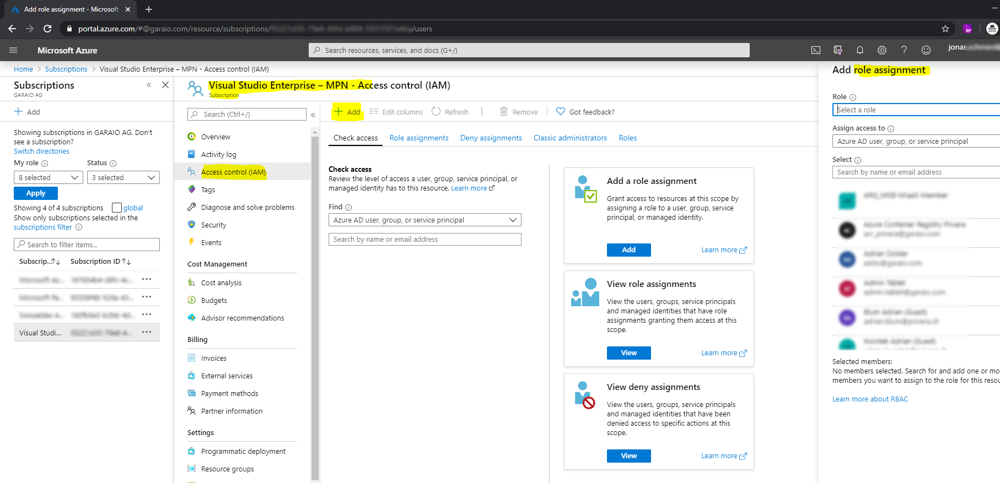
1. 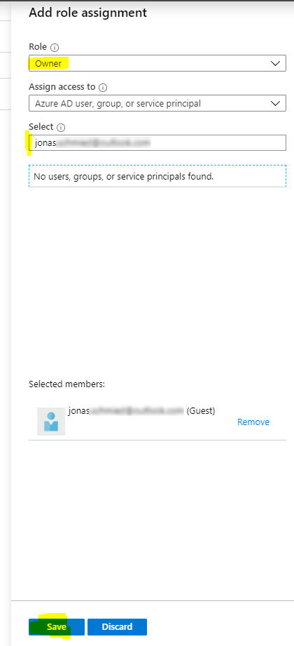
1. 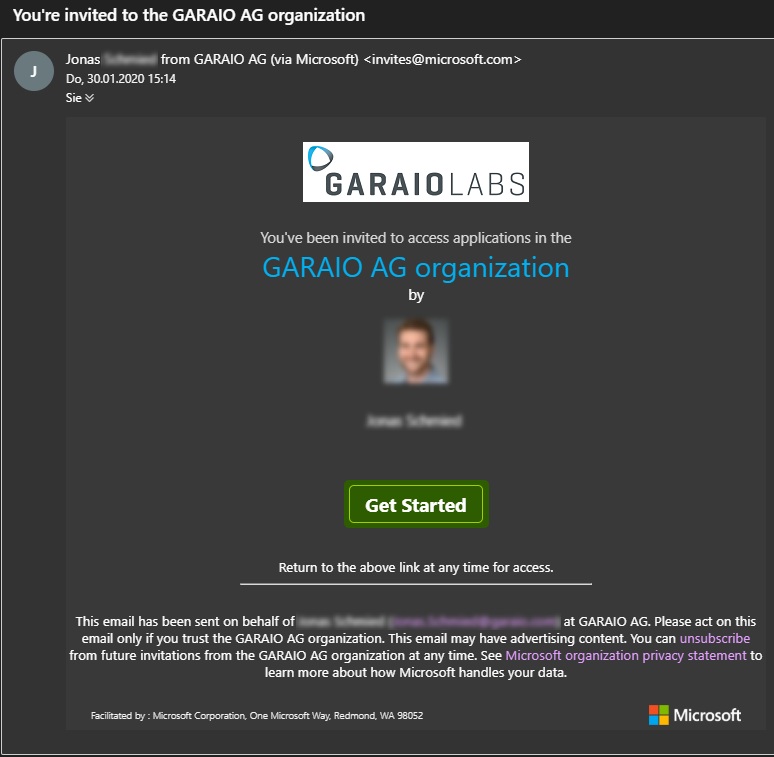
1. 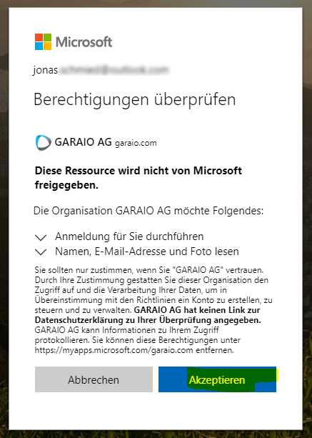
1. 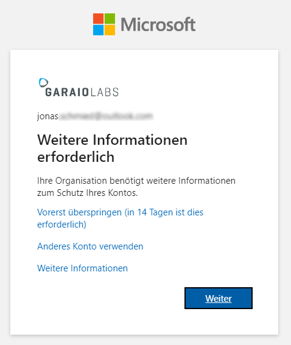
1. 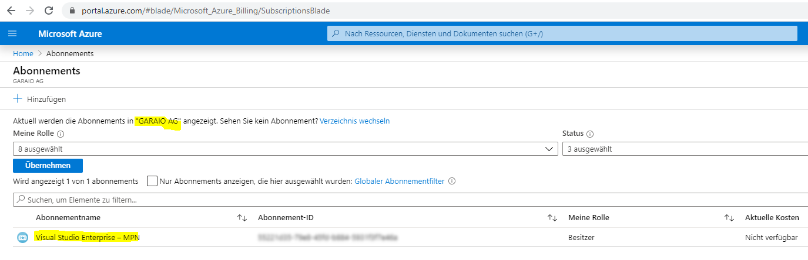
1. 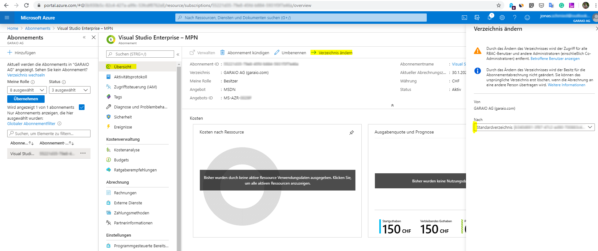