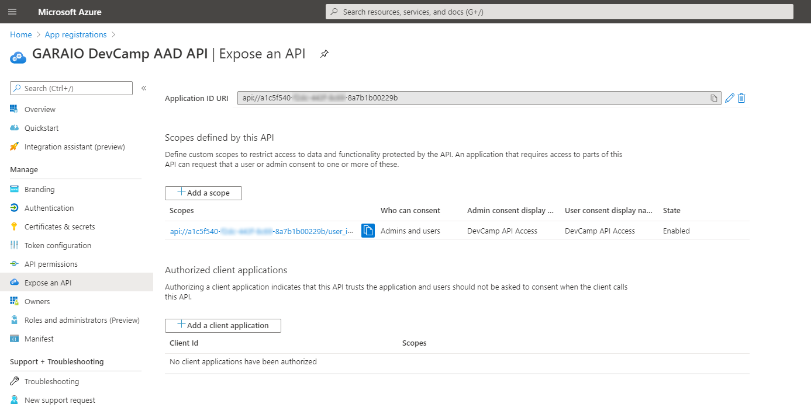
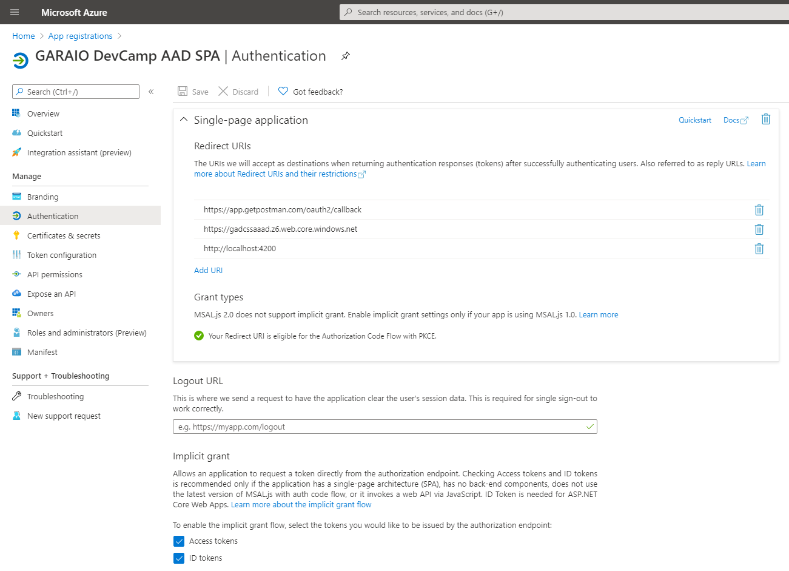
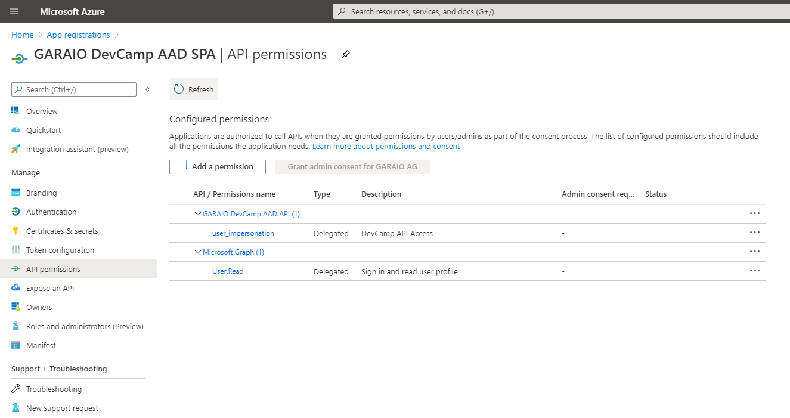
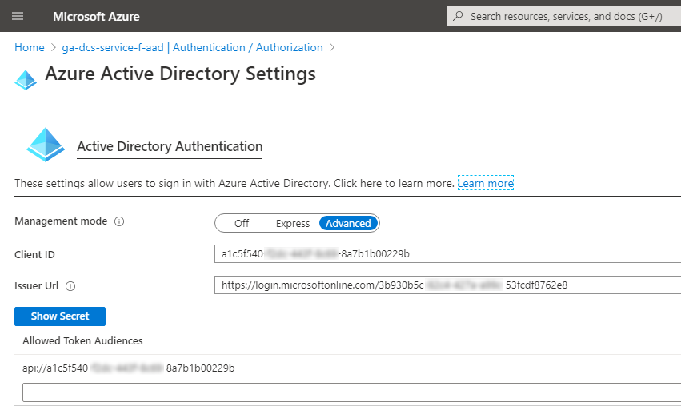
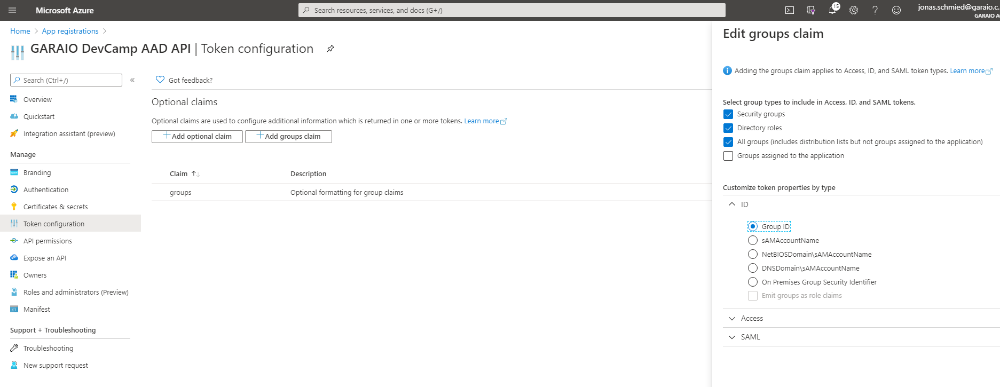

# Summary
There is already an extensively documented solution [to setup user management and authentication based on Azure Activce Directory B2C](../D04-AAD-B2C-multi-tenancy/Readme.md). Experience showed that the setup of an enterprise solution with AAD is principally identical but has some small differences which easily becomes pitfalls.

## MSAL 2.0
The implicit OAuth2 flow will be replaced in Microsoft Identity Solutions with the more robust Auth Code Flow. At the moment this is available as an early Preview release only. So this documented setup completely bases on MSAL 1.0 an the Implicit Flow.

# Setup
## App Registration API
- Choose Tenant-Strategy:
  - Single -> Authority = `https://login.microsoftonline.com/<tenant-id>` (leads to branded login page)
  - Multi -> Authority = `https://login.microsoftonline.com/common` (leads to "general" Microsoft login page)
- Platform Web -> Reply-Urls:
  - (optional) `https://app.getpostman.com/oauth2/callback` (for tests with Postman)
  - (optional) `https://<function-name>.azurewebsites.net/.auth/login/aad/callback` (to test function directly in Browser)
- Implicit Grant:
  - (optional) Access tokens (for tests with Postman)
  - (optional) ID tokens (to test function directly in Browser)
- Expose an API:
  - App ID URI (Recommendation: Use proposed pattern `api://{app-id}`)
  - Add Scope
	- Name: user_impersonation (Recommendation, should work with any term but this is sort of a standard convention)
	- Consent: Admins and users (Recommendation, keep it flexible especially for testing)
	- Descriptions: Examples "DevCamp API Access" / "Allows the SPA to access the Function or App Service Endpoints"

[**App Registration Manifest**](./Source/AppRegistrationApi.json)

## App Registration SPA
- Choose Tenant-Strategy: Same impact as described above. Normally these settings correlate on bot App Registrations.
- Platform Single-page application -> Reply-Urls:
  - (required) Every host where the SPA can be accessed, e.g. `https://<storage-account>.z6.web.core.windows.net`, `http://localhost:4200` -> If SPA is provisioned with a CDN, then only this host URL is required (hides/replaces Storage Account)
  - (optional) https://app.getpostman.com/oauth2/callback (for tests with Postman)
- Implicit Grant:
  - (required) Access tokens (for MSAL)
  - (required) ID tokens (for MSAL)
- API permissions:
  - Add Scope created in API App Registration
  

[**App Registration Manifest**](./Source/AppRegistrationSpa.json)
  
## Function Authentication
- AAD Advanced
  - Client ID: AppId of App Registration API
  - Issuer Url: `https://login.microsoftonline.com/<tenant-id>`
  - Allowed Token Audiences: `api://{app-id}` (App ID URI)
  - (no Secret, Token Store can be set to "On" or "Off")
- Hint: Don't forget the "Save" Button. After changes refresh the page cause it often has actualization issues

[**ARM Deployment Template**](./Source/ApiFunctionAuthConfig-azuredeploy.json)

## SPA MSAL konfigurieren:
- **CAUTION 1**: _Don't forget the Auth Key of the Function (transmitted either as Query-Param "code" or Header "x-function-key"). Otherwise you get a HTTP 401 which may confuse with MSAL setup. This doesn't apply if you configured the AuthLevel to "anonymous" (but this is not recommended)._
- **CAUTION 2**: _Configure the Function / App Service URL with *HTTPS* (it is displayed in some places in the Portal with "http://..."). If you don't follow this, the Function will return regularly (as configured to support https only) a HTTP 301 with a redirect in the header. This leads to misleading CORS errors thrown by the Angular MSAL library when doing the OPTIONS call (shows something like "redirect not supported"). It may not be obvious to find the cause.
- Configurations:
  - ClientId: AppId of SPA App Registration
  - Authority: `https://login.microsoftonline.com/<tenant-id>` (App Registration Single Tenant) or `https://login.microsoftonline.com/common` (App Registration Multi Tenant)
  - Scopes: All scopes registered in SPA App Registration, especially important when User has to consent
  
Useful links:
* https://medium.com/medialesson/authenticating-angular-apps-with-azure-active-directory-using-msal-angular-1-0-d7b2f4914be9

# Consent to required permissions
It is always simpler for enterprise applications that an Directory Administrator grants the permissions on behalf of the users. To simplify setup you can [generate a direct URL which you can provide to the Administrator](https://docs.microsoft.com/en-us/azure/active-directory/manage-apps/grant-admin-consent#construct-the-url-for-granting-tenant-wide-admin-consent).

If this is not possible, make sure that the consent dialog is correctly shown with MSAL configuration. For Angular you need to define all relevant `consentScopes` and also pass them wherever an explicit call of `loginRedirect()` / `loginPopup()` is made.

# Additional functionality: Application-Roles
Often not all enterprise users are treated equal in the application but have to be assigned to multiple groups / roles. Azure Active Directory provides support for this functionality with two different approaches.

## (A) Role-Assignment inside the backend-application (Function) based on membership of user in AD group(s)
- https://github.com/Azure-Samples/active-directory-aspnetcore-webapp-openidconnect-v2/blob/master/5-WebApp-AuthZ/5-2-Groups/README-incremental-instructions.md
- App Reg API -> Token configuration -> Add groups claim -> All groups / ID -> Group ID

## (B) Definition of custom Application-Roles inside AAD and assignment of users to such roles by IT administrator (either based on individual accounts or groups)
- https://docs.microsoft.com/de-de/azure/architecture/multitenant-identity/app-roles
- https://github.com/Azure-Samples/active-directory-aspnetcore-webapp-openidconnect-v2/blob/master/5-WebApp-AuthZ/5-1-Roles/README.md
- https://medium.com/medialesson/role-based-authorization-in-azure-functions-with-azure-ad-and-app-roles-b1fed5714c91
- App Reg API -> Manifest -> manual definition of AppRoles
