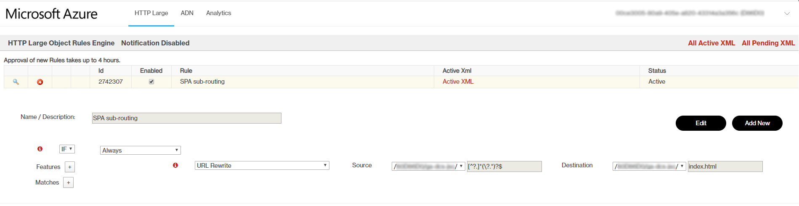
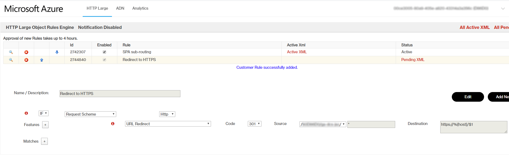

# Summary
The problem with client side routing in SPA's with static website hosting of Storage Account can be resolved with Azure CDN using an URL Rewrite Rule. This also delivers the prefered way to use a custom domain with SSL (a direct assignment to the Storage Account is only possible with sub-domains).

# Steps
## 1. Create and link Azure CDN
Follow [this guideline](https://medium.com/@antbutcher89/hosting-a-react-js-app-on-azure-blob-storage-azure-cdn-for-ssl-and-routing-8fdf4a48feeb) to setup and link a CDN using "Premium Verizon". In the meantime, "URL Rewrite" rules should be supported also with the Standard Microsoft CDN according to [this documentation](https://docs.microsoft.com/en-us/azure/cdn/cdn-standard-rules-engine-actions) and [comparison table](https://docs.microsoft.com/en-us/azure/cdn/cdn-features).

## 2. Create a DNS Zone for a Custom Domain
This step is only relevant if the domain is not yet linked to a name-server (i.e. to configure CNAME records for subdomains). Follow [this tutorial](https://docs.microsoft.com/en-us/azure/dns/dns-delegate-domain-azure-dns).

## 3. Link subdomain with CDN Endpoint
Follow [this tutorial](https://docs.microsoft.com/en-us/azure/dns/dns-custom-domain#azure-cdn).

## 4. Enforce HTTPS by automatic redirection
Follow [this tutorial](https://medium.com/azure-architects/configuring-azure-cdn-http-https-redirection-2a9e4aab0a77).

# Additional Notes
As mentionned it should be possible to achieve the same result with Standard Microsoft CDN. This would have the advantage that the rule definitions could be defined and included in ARM templates (seems not possible with Verizon based CDN rules, see [comment at he bottom of this site](https://docs.microsoft.com/en-us/azure/cdn/cdn-verizon-premium-rules-engine)).
